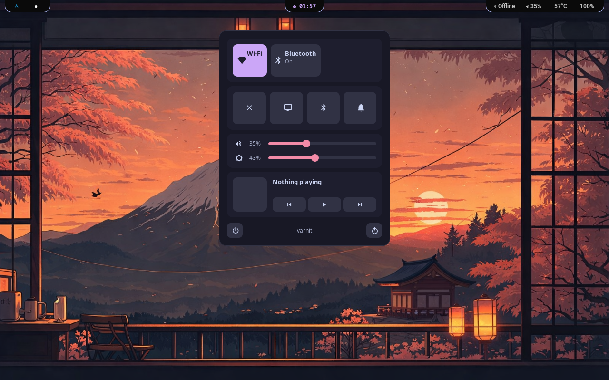
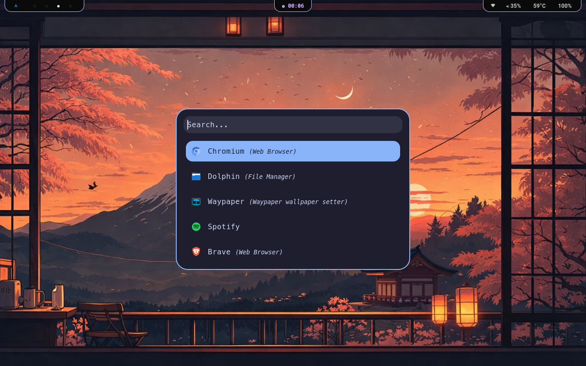
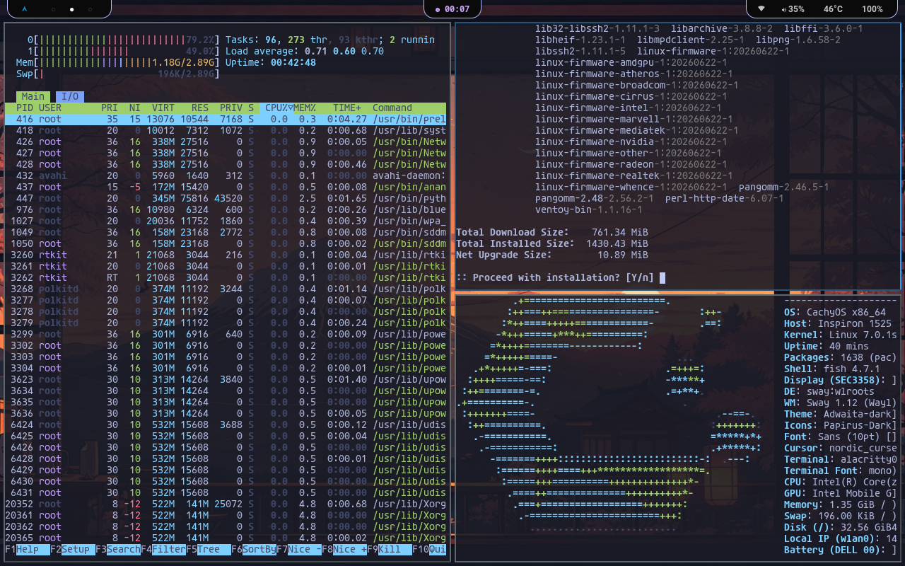

# Outraged-rice-
#Plain Desktop 

#Instructions 

#Dependences 
Brightnessctl 
Pulseaudio 
Waybar 
Rofi 
Eww 

#Dependences install commands

#Arch :

sudo pacman -S brightnessctl rofi pulseaudio waybar  && yay -S eww-git

#Fedora:
sudo dnf install brightnessctl rofi pulseaudio waybar rust cargo gcc-c++ gtk3-devel gtk-layer-shell-devel pango-devel -y && git clone https://github.com && cd eww && cargo build --release --no-default-features --features wayland

#Ubuntu :
sudo apt update && sudo apt install brightnessctl rofi pulseaudio waybar build-essential libgtk-3-dev -y && curl --proto '=https' --tlsv1.2 -sSf https://rustup.rs | sh -s -- -y && source "$HOME/.cargo/env" && git clone https://github.com && cd eww && cargo build --release --no-default-features --features wayland

#the Eww wifi and rofi codes used in the control center is not working properly.

the 
